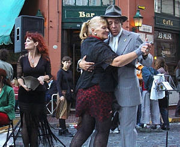
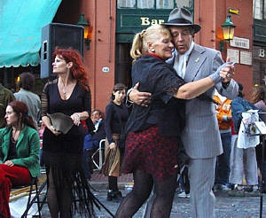

# Steroscopic Imaging

Stereoscopic images are two pictures of the same scene taken from slightly different positions — one for the left eye and one for the right. This is how our eyes naturally see the world: each eye has a slightly different view, and when our brain combines those views, we see depth — things that look near or far. A stereoscopic image works the same way. When each eye sees its own picture through something like a VR viewer, your brain turns them into one 3D-looking scene.

| Left Eye View | Right Eye View |
|:-------------:|:--------------:|
|  |  |

Stereoscopic imaging is the process of making those two images. It means capturing or creating two views of the same thing from slightly different angles — just like your eyes would see it. This can be done with cameras (by taking two photos a little bit apart), or in computers (by rendering a scene twice with a small horizontal shift). It’s how we build pictures or videos that feel like you can step into them.